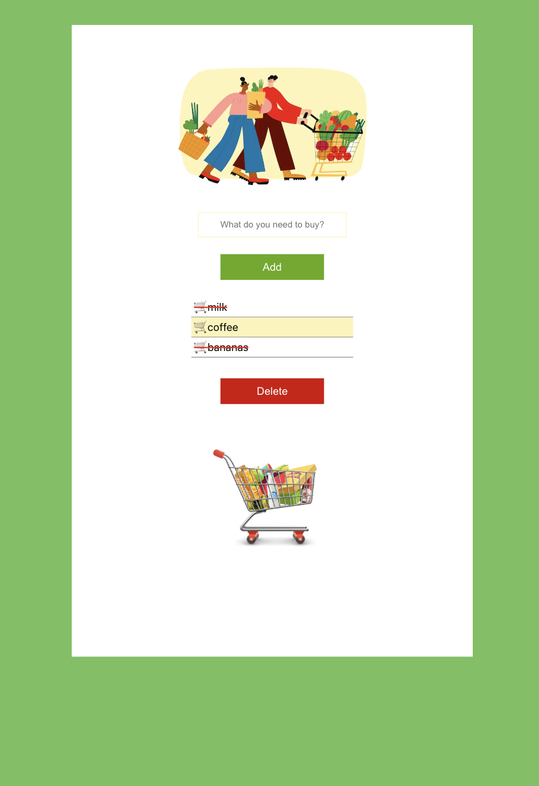

<hr>
### Did you again forgot to buy some food?

<hr>

<h1>Grocery list</h1>


## Description
**_Grocery list_** is an application for helping users remember essential items to buy

## 💻 Build with 
[](#)

## Usage
🔶 Add items to your list 

✅ Mark items as purchased 

❌ Remove unnecessary items 

## Installation
```bash
https://github.com/InnaKlimenteva/grocery-list-react.git
```

